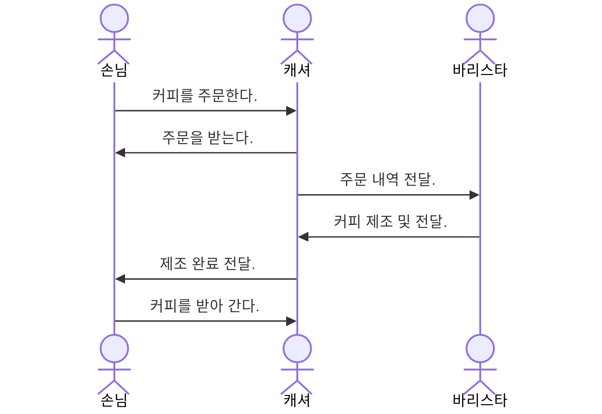

# Javascript
OOP Javascript

## 자바스크립트는 객체지향 언어인가?

### 프로그램 패러다임

모던 랭귀지의 경우 폴리그랏의 형태로 발전.

* 절차지향 패러다임
* 객체지향 패러다임
* 함수형 패러다임

### 객체

객체는 다른 객체와 협력하여 역할과 책임을 수행한다.

#### 객체의 상호작용
* 손님: 음료 주문
* 캐셔: 주문 받기
* 바리스타: 음료 제조

