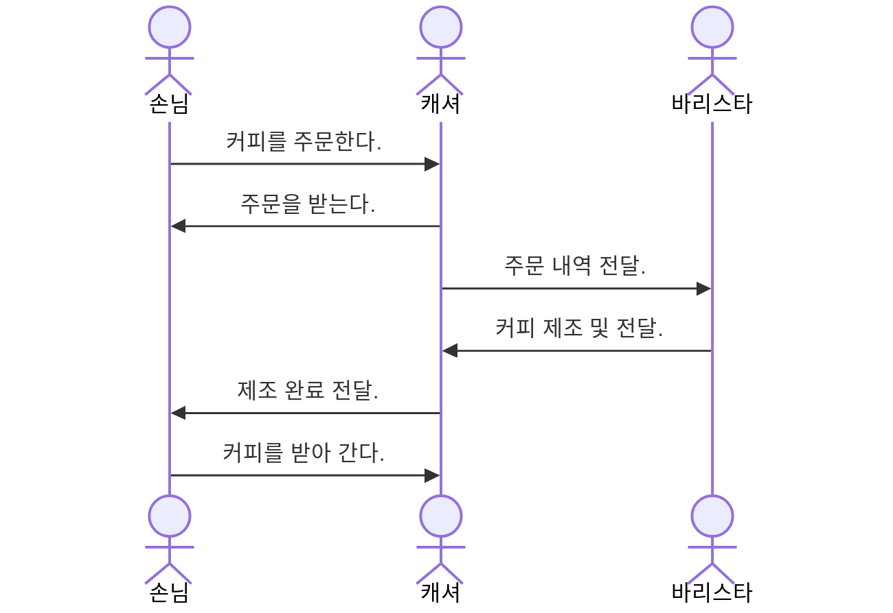

# Javascript
OOP Javascript

https://khs-note.github.io/aidt-001/todo-list.html

## 자바스크립트는 객체지향 언어인가?

### 프로그램 패러다임

모던 랭귀지의 경우 폴리그랏의 형태로 발전.

* 절차지향 패러다임
* 객체지향 패러다임
* 함수형 패러다임

### 객체

객체는 다른 객체와 협력하여 역할과 책임을 수행한다.

#### 객체의 상호작용
* 손님: 음료 주문
* 캐셔: 주문 받기
* 바리스타: 음료 제조



## 자바스크립트 기초

### ECMA Script

2015년 ES5에서 ES6로 표준 개정.

### 기본개념

호이스팅
```js
function foo() {
    var vl= _getValue();
    return vl;

    function _getValue() {
        return 'foo';
    }
}

foo();
```

논리연산자와 트리거
```js
var src;
console.log(!0, !'', !src, src==undefined, src=='undefined');

foo(1);
foo();
function foo(a) {
    var fst= a|| 0;
    console.log('foo:', {a, fst});
}
```

배열같은 객체
```js
foo(1, 'a', {a:1});
function foo() {
    var size= arguments.length;
    for(var i=0; i<size; i++) {
        console.log(['arg', i].join('-'), arguments[i]);
    }
}
```

this와 argurments
```js
var v= 'v';
var obj= {
    v: 1,
    foo: foo,
    bar: function() {
        console.log('bar:', arguments, Array.prototype.slice.call(arguments));
        [].slice.call(arguments).forEach(v=> console.log('--> ', v));
        // 오류: arguments는 객체이므로 `forEach`지원하지 않음
        arguments.forEach(v=> console.log('--> ', v))
    }
};

function foo(vl) {
    console.log('foo:', this.v, vl);
}

obj.foo('obj 바인딩');
foo('window 바인딩');
foo.call(obj, 'window 바인딩');
obj.bar(1, 'a');
```

고차함수
```js
var plus= genOperator(2);
plus(2);

function genOperator(a) {
    return function(b) {
        return a+ b;
    }
}
```

클로저와 즉시 실행 함수
```js
var plus= (function (a) {
    return function(b) {
        return a+ b;
    }
})(2);
plus(2);
```

객체의 상속
```js
// 프로토타입 체인
function Car() {
    this.name= 'Car';
}
Car.prototype.start= function() {
    console.log('car::start', this.name); 
};
Car.prototype.stop= function() {
    console.log('car::stop', this.name); 
};

function Taxi() {
    this.name= 'Taxi';
}
Taxi.prototype= Object.create(Car.prototype);
Taxi.prototype.amount= function() {
    console.log('taxi::amount');
};

var car= new Car();
car.start(), car.stop();

var taxi= new Taxi();
taxi.start(), taxi.stop(), taxi.amount();
```

팩토리 함수를 이용한 객체의 믹스인
```js
    var car= {
        name: 'Car',
        start: function() {
            console.log('car::start', this.name);
        },
        stop: function() {
            console.log('car::start', this.name);
        },
    };

    var taxi= mixinCar(car, {
        name: 'Taxi',
        stop: function() {
            console.log('taxi::start', this.name, this.amount());
        },
        amount: function() {
            return 10000;
        }
    });

    car.start(), car.stop();
    taxi.start(), taxi.stop();

    // 팩토리함수
    function mixinCar(car, opt) {
        var result= Object.create(car);
        for(var k in opt) {
            result[k]= opt[k];
        }
        return result;
    }
```

### 모던 스크립트

변수의 선언
```js
var old= 'a';
// 변수의 불변할당
const a= 1;
// 변경 가능한 변수
let b= 2;

{
    // const, let 모두 블럭 범위 영역에 영햠 받음
    const a= 10;
    let b= 20;

    // old 변수 생명주기는 함수의 범위 영역에 영향 받음
    var old= 'b';
    (function() {
        var old= 'c';
    })();
}

console.log(old, a, b);
```

템플릿 리터럴
```js
const v= `1`;
const str= `문자열\n${$v}`;
```

디스트럭처링과 펼침연산자
```js
const arr= [1, 2, 3];
const obj= {a:1, b:2, c:3};

const [a1, ,a3]= arr;
const {a, b, c}= obj;

console.log(a1, a3);
console.log(a, b, c);

const arr2= [...arr, 4, 5];
const obj2= {...obj, d:4};
console.log(arr2, obj2);
```

화살표 함수
```js
const fn= (a, b)=> {
    return 1;
};

const obj= {
    foo(fn) {
        fn(this);
    },
    bar: fn=> fn(this),
};

obj.foo(v=> console.log(v));
obj.bar(v=> console.log(v));
```

함수의 매개변수 기본값과 나머지값
```js
const foo= (vl=0, ...args)=> {
    const [a1,,a3]= args;
    console.log({vl, a1, a3});
};

foo();
foo(1, 'a');
foo(1, 'a', [1,2], {a:1});
```

꼬리물기 최적화
```js
const rec= v=> v? v+rec(v-1): v;
const tail= (v, ac=0)=> v? tail(v-1, ac+v): ac;
console.log(tail(10), rec(10));
```

프로미스와 프로미스 패턴(all, allSettled, any, race)

클래스

비동기(async/await) 코루틴
