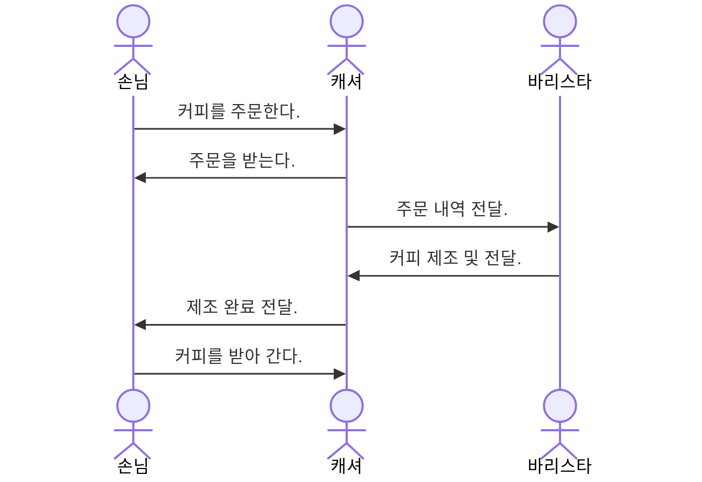

# Javascript
OOP Javascript

https://khs-note.github.io/aidt-001/todo-list.html

## 자바스크립트는 객체지향 언어인가?

### 프로그램 패러다임

모던 랭귀지의 경우 폴리그랏의 형태로 발전.

* 절차지향 패러다임
* 객체지향 패러다임
* 함수형 패러다임

### 객체

객체는 다른 객체와 협력하여 역할과 책임을 수행한다.

#### 객체의 상호작용
* 손님: 음료 주문
* 캐셔: 주문 받기
* 바리스타: 음료 제조

## 자바스크립트 기초

### ECMA Script

2015년 ES5에서 ES6로 표준 개정.

### 기본개념

호이스팅

배열같은 객체

논리연산자와 트리거

this와 argurments

고차함수

클로저와 즉시 실행 함수

### 모던 스크립트

변수의 선언

템플릿 리터럴

디스트럭처링과 객체의 간편표기법

펼침연산자

화살표 함수

매개변수 기본값과 나머지값

꼬리물기 최적화

프로미스

프로미스 패턴(all, allSettled, any, race)

클래스

비동기 처리(async/await)

제너레이터
